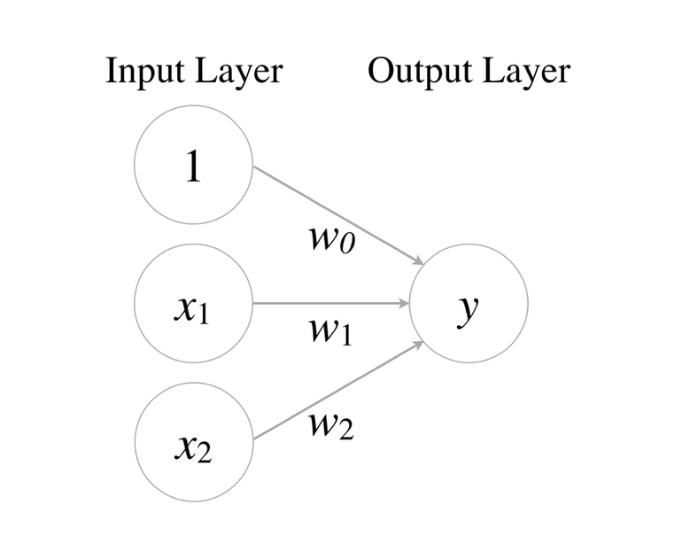
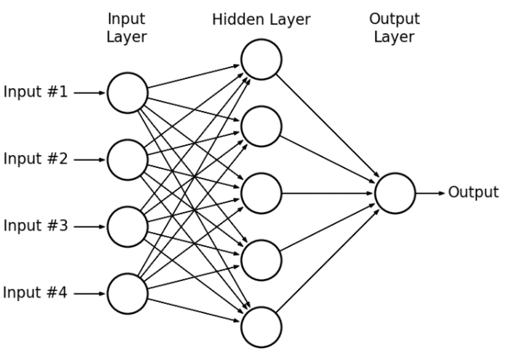

딥러닝의 역사

AND, OR 는 직선 하나만 있으면 풀수 있는데 이 직선은 논리회귀로 쉽게 제작 가능(AI의 가능성 확인)
y=w_0+w_1x_1+w_2x_2
=> 수식을 그림으로 나타내면

Perceptron(퍼셉트론)

XOR 문제
선형회귀로는 AND, OR 문제는 잘 풀었지만 XOR 문제는 풀지 못했음
Perceptron을 여러개 붙인 Multilayer Perceptrons (MLP)라는 개념을 도입

한 개의 perceptron으로는 XOR를 풀 수 없고, MLP를 써야하는데 각각의 weight과 bias를 학습시키는 데 너무 많은 계산이 필요(1969 당시의 기술로는 불가능 - 딥러닝 발전 중단)

Backpropagation(역전파)
1974년 Paul Werbos(폴) 교수가 다음과 같이 주장함 1. 우리는 W(weight)와 b(bias)를 이용해서 주어진 입력을 가지고 출력을 만들어 낼 수 있다. 2. 그런데 MLP가 만들어낸 출력이 정답값과 다를 경우 W와 b를 조절해야한다. 3. 그것을 조절하는 가장 좋은 방법은 **출력에서 Error(오차)를 발견하여 뒤에서 앞으로 점차 조절하는 방법**이 필요하다.
1986년 Hinton 교수가 다시 발표하면서 알려짐
XOR 문제는 MLP를 풀 수 있게 되어 해결될 수 있었고 그 핵심방법은 바로 역전파 알고리즘
