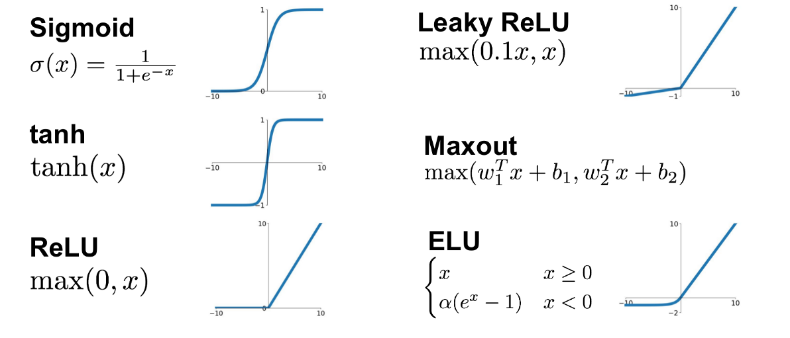

딥러닝의 주요 개념

	batch와 iteration
		데이터셋이 너무 크면 한꺼번에 올릴수 있는 메모리는 너무 비쌈 그러므로 데이터셋을 쪼개서 사용하는데
		쪼개는 단위를 Batch(배치)
		Batch(배치)를 가지고 반복하는 과정을 Iteration(이터레이션)

	epoch(에폭)
		데이터셋을 가지고 반복 학습을 하는 횟수
		batch를 몇 개로 나눠놓았냐에 상관 없이 전체 데이터셋을 한 번 돌 때 한 epoch이 끝남

	Activation functions (활성화 함수)
		활성화 함수는 뇌의 뉴런이 다음 뉴런으로 전달할 때 보내는 전기신호의 특성에서 영감을 받아 만들어짐
		수많은 뉴런들은 서로 서로 빠짐없이 연결되어 있는데 전기 신호의 크기가 특정 임계치(Threshold)를 넘어야만 다음 뉴런으로 신호를 전달하도록 설계되어 있음
		연구자들은 뉴런의 신호전달 체계를 흉내내는 함수를 수학적으로 만들었는데, 전기 신호의 임계치를 넘어야 다음 뉴런이 활성화 한다고해서 활성화 함수라고 부름
		활성화 함수는 비선형 함수여야함

		보편적으로 사용되는 활성화 함수(ReLU) - 학습이 빠르고, 연산비용이 적고, 구현이 간단함
		활성화 함수를 교체하는 노가다를 거쳐 최종적으로 정확도를 높이는 작업을 동반(이러한 노가다의 과정을 모델튜닝)

	Overfitting, Underfitting (과적합, 과소적합)
		Overfitting(과적합)
			Training loss는 점점 낮아지는데 Validation loss가 높아지는 시점
			문제의 난이도에 비해 모델의 복잡도(Complexity)가 클 경우 가장 많이 발생하는 현상
			해결 방법 - 데이터를 더 모으기, Data augmenation, Dropout 
		Underfitting(과소적합)
			문제의 난이도에 비해 모델의 복잡도가 낮을 경우 문제를 제대로 풀지 못하는 현상
	수십번의 튜닝 과정을 거쳐 최적합(Best fit)의 모델을 찾아야함		
	
		
