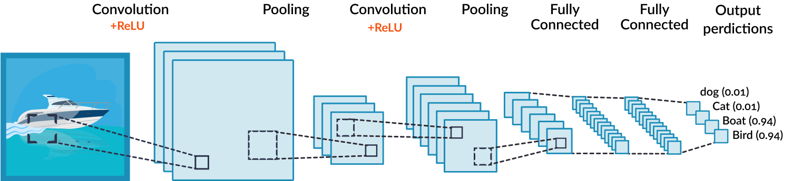
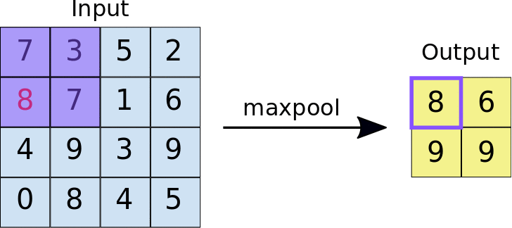
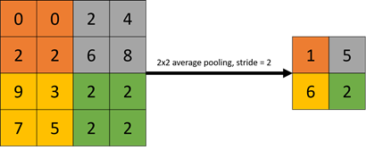
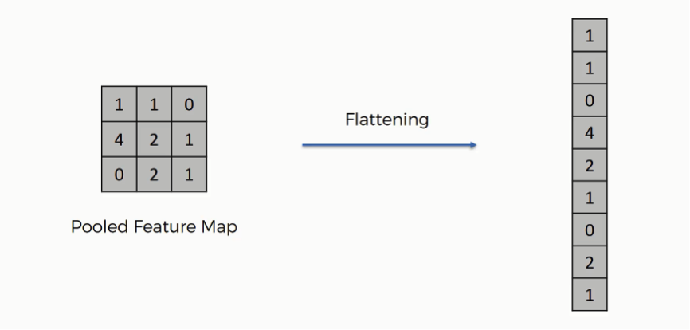
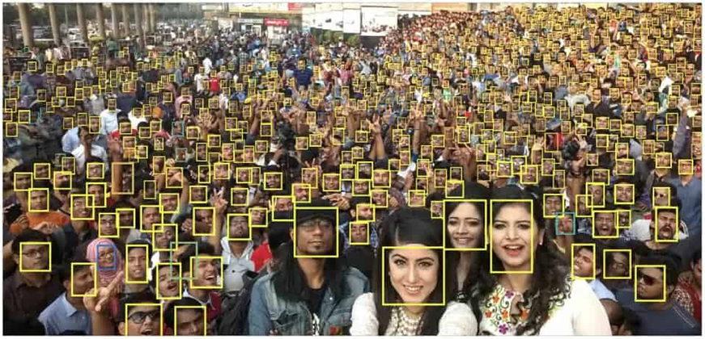
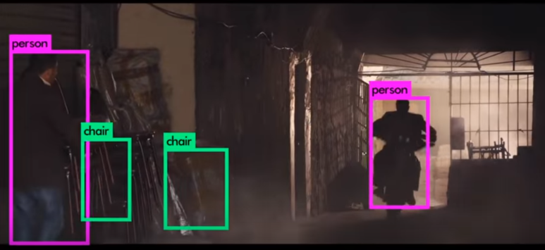
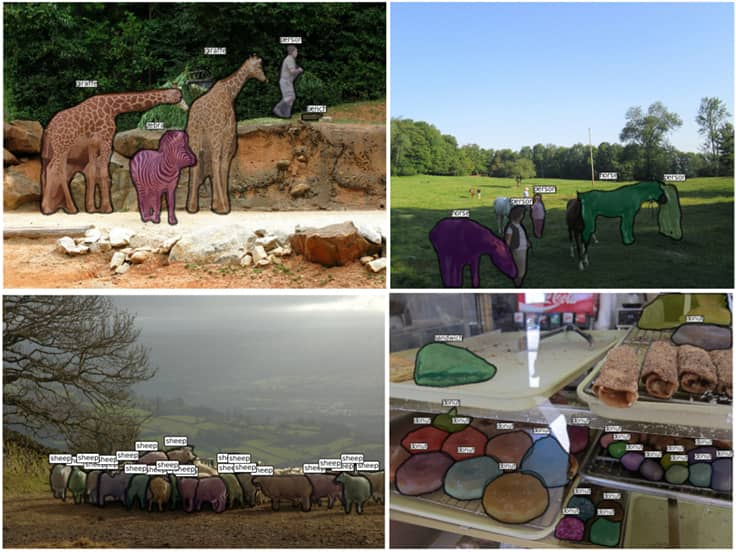

CNN(합성곱 신경망)의 구성

- 합성곱 계층(Convolution layer)과 완전연결 계층(Dense layer)을 함께 사용
- 합성곱 계층 + 활성화 함수 + 풀링을 반복하며 점점 작아지지만 핵심적인 특성들을 뽑아 내는데요. 여기서 풀링 계층(Pooling layer)은 특성 맵의 중요부분을 추출하여 저장하는 역할

 Max pooling

- 2x2 크기의 풀 사이즈(Pool size)로 스트라이드 2의 Max pooling 계층을 통과할 경우 2x2 크기의 특성 맵에서 가장 큰 값들을 추출

Average pooling

- 2x2 크기의 특성 맵에서 평균 값을 추출

두 번째 풀링 계층을 지나면 완전연결 계층과 연결이 되어야 하는데 풀링을 통과한 특성 맵은 2차원이고 완전연결 계층은 1차원이므로 연산이 불가능

평탄화 계층(Flatten layer)

- 2차원을 1차원으로 펼치는 작업
- 완전연결 계층(=Dense=Fully connected) + 활성화 함수의 반복을 통해 점점 노드의 개수를 축소시키다가 마지막에 Softmax 활성화 함수를 통과하고 출력층으로 결과를 출력

-----------------------------------------------------

CNN의 활용
- 물체 인식(Object Detection)

    

ex) YOLO(You Only Look Once) - 다른 real-time detection에 비해 정확도가 높아 유명한 Computer Vision 알고리즘

- 이미지 분할(Segmentation) - 각각의 오브젝트에 속한 픽셀들을 분리하는 것

ex) 인물과 배경에서는 배경은 흐릿하게 처리해서 인물을 Focus하는 기술
    의료영상에서는  양성/음성부분을 파악하고 악성인 부분을 Segmentation하여 인식할 수 있도록 도와줌
    자율주행 물체인식, 자세 인식(Pose Detection), 화질개선(Super Resolution), Style Transfer, 사진 색 복원(Colorization)