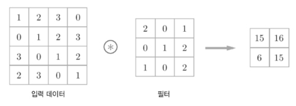
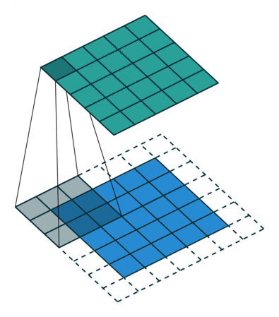
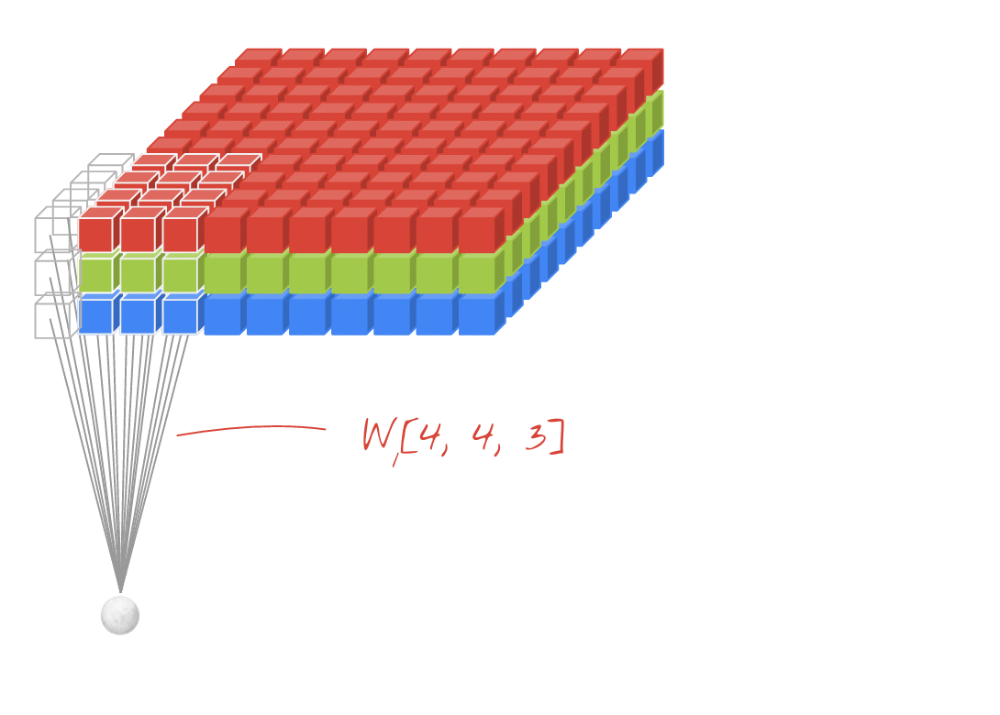

Convolutional Neural Networks (합성곱 신경망)

	합성곱(Convolution)은 예전부터 컴퓨터 비전(Computer Vision, CV) 분야에서 많이 쓰이는 이미지 처리 방식

-> 합성곱 계산 방식( 입력데이터와 필터의 각각의 요소를 서로 곱한 후 다 더함 )
	Yann Lecun 교수의 합성곱 신경망(CNN) => 이미지 딥러닝의 전성기 활성화

-> 5x5 크기의 입력이 주어졌을 때, 3x3짜리 필터를 사용하여 합성곱을 하면 3x3 크기의 특성맵(Feature map)을 뽑아낼 수 있음
    필터(Filter 또는 Kernel)를 한 칸씩 오른쪽으로 움직이며 합성곱 연산을 하는데요, 이 때 이동하는 간격을 스트라이드(Stride)

-> 합성곱 연산의 특성상 출력값인 특성 맵의 크기가 줄어드는데 이 현상을 방지하기 위해 padding or Margin을 주어 stride가 1일 때 입력값과 특성 맵의 크기를 같게 만들수 있음

->위에서는 1개의 필터를 사용하여 연산을 하였지만 여러개의 필터를 이용하여 합성곱 신경망의 성능을 높일 수 있음
   이미지는 3차원(가로, 세로, 채널)
- 입력 이미지 크기: (10, 10, 3)
- 필터의 크기: (4, 4, 3)
- 필터의 개수 :2
- 출력 특성 맵의 크기: (10, 10, 2)