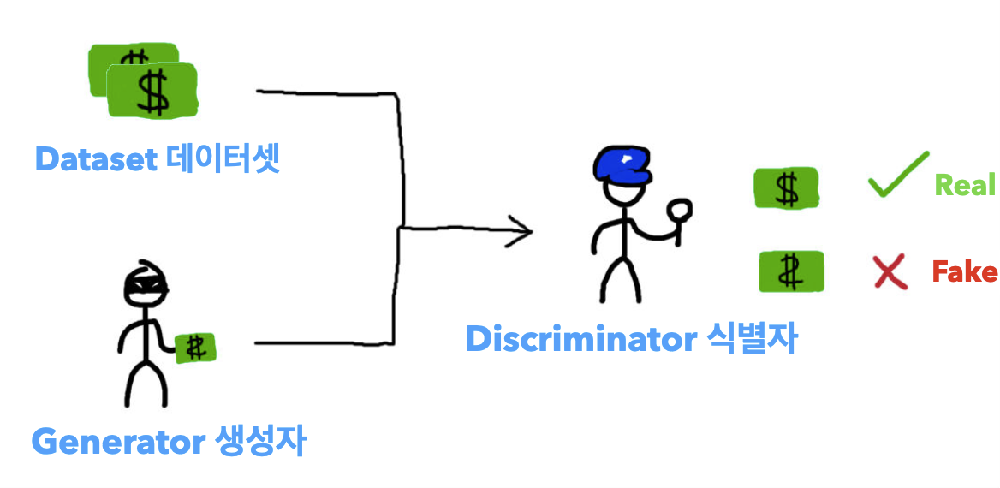
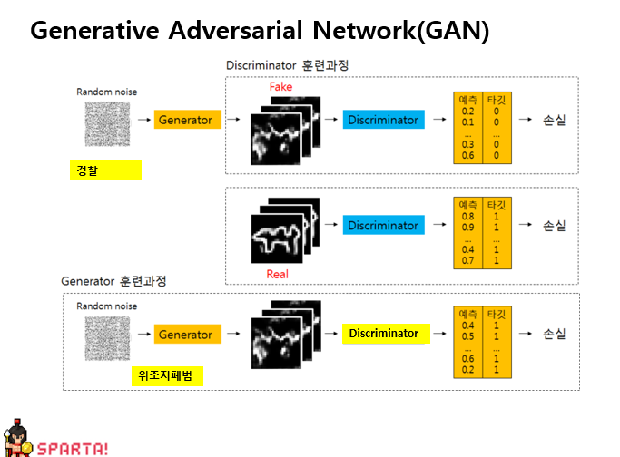

Generative Adversarial Network(GAN) (생성적 적대 신경망)
- 서로 적대(Adversarial)하는 관계의 2가지 모델(생성 모델과 판별 모델)을 동시에 사용하는 기술

- GAN은 위조지폐범과 이를 보고 적발하는 경찰의 관계로 설명할 수 있습니다.
    - 생성모델 (위조지폐범): 경찰도 구분 못하는 진짜같은 위조지폐를 만들자!
    - 판별모델 (경찰): 진짜 지폐와 위조 지폐를 잘 구분해내자!
    => 서로 발전의 관계가 되어 원본과 구별이 어려운 가짜 이미지가 만들어지게 됨

작용 방법

ex)
- CycleGAN - 겨울 -> 여름 ...(이미지 계절 변경)
- StarGAN - 머리색
- CartoonGAN - 사람->캐릭터화
- DeepFake - 인물의 사진을 AI로 학습시켜 가상의 영상 생성
- BeautyGAN - 다른 사람의 메이크업을 남의 얼굴에 입히는 방식
- Toonify Yourself - 사람을 만화화 함