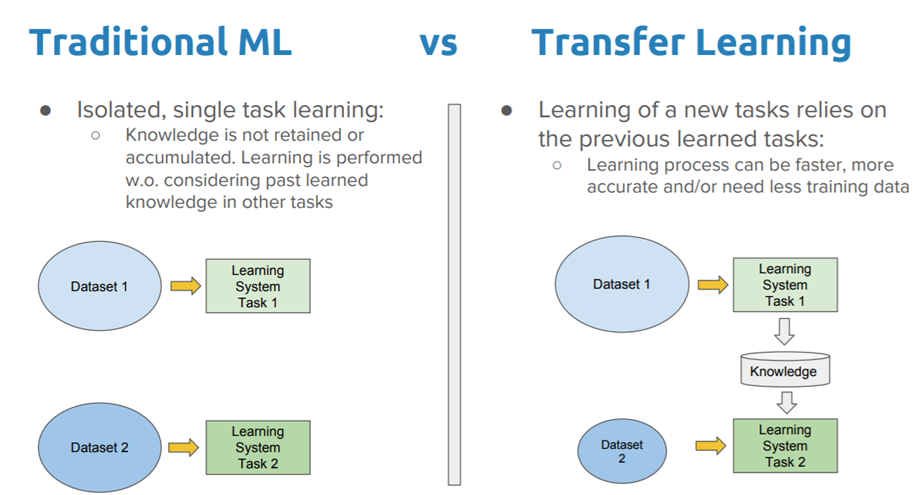

Transfer Learning (전이학습)
- 과거에 문제를 해결하면서 축적된 경험을 토대로 그것과 유사한 문제를 해결하도록 신경망을 학습시키는 방법
- 학습 속도가 빠르고 (빠른 수렴), 더 정확하고, 상대적으로 적은 데이터셋으로 좋은 결과를 낼 수 있기 때문에 실무에서도 자주 사용하는 방법

-   다른 형태의 데이터셋에 대해서도 효과를 보인다는 것
    ex) 1000개의 동물/사물을 분류하는 ImageNet이라는 대회에서 학습한 모델들을 가져와 얼굴 인식 데이터셋에 학습시켜도 좋은 결과를 얻을 수 있었음