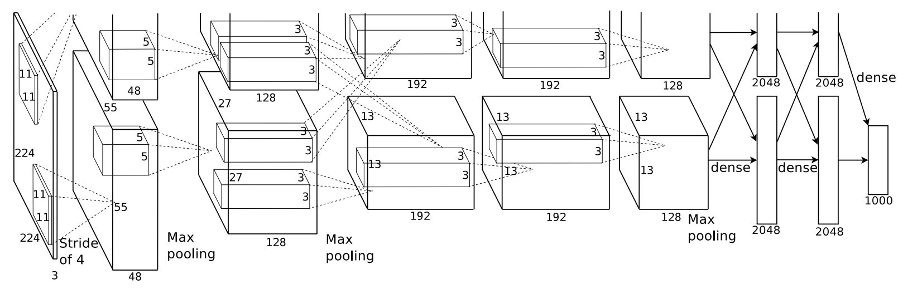
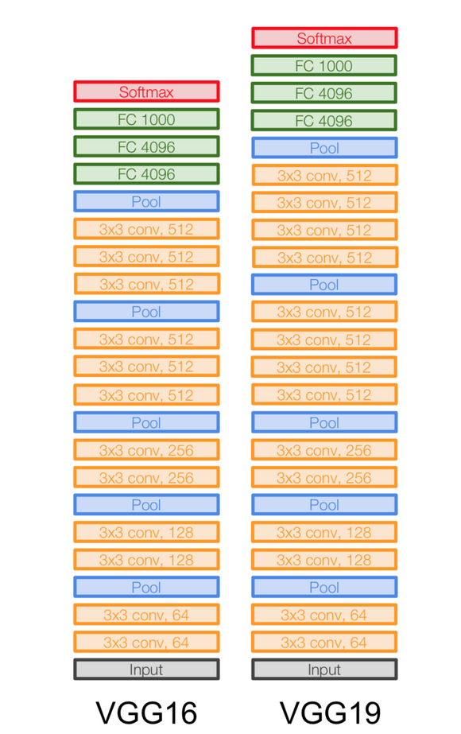
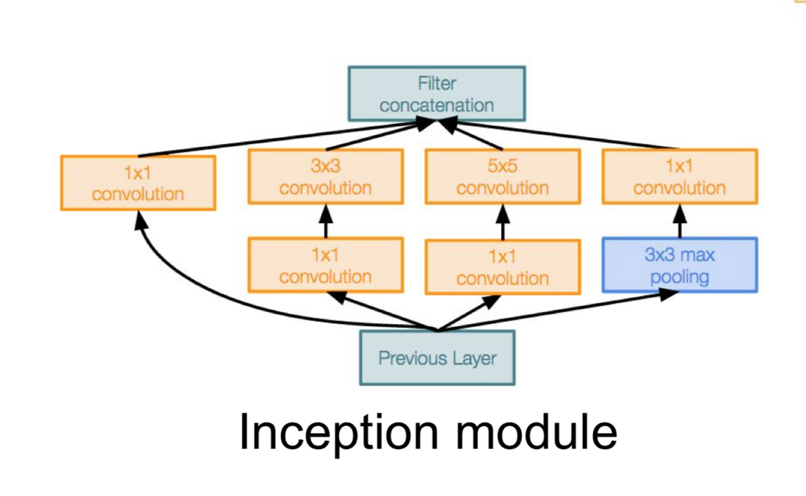
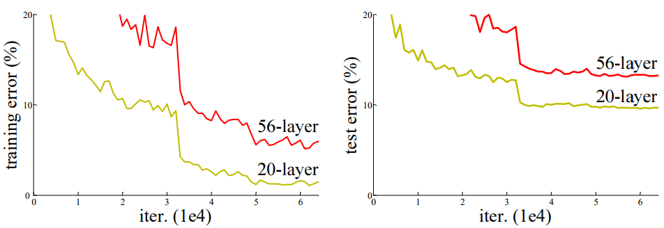
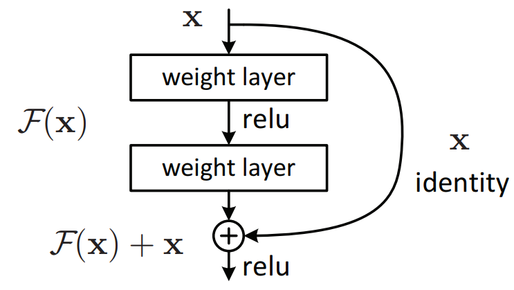

다양한 CNN 종류

AlexNet(2012)

- AlexNet은 의미있는 성능을 낸 첫 번째 합성곱 신경망
- Dropout과 Image augmentation 기법을 효과적으로 적용하여 딥러닝에 많은 기여

VGGNet(2014)

- 엄청 Deep한 모델(파라미터의 개수가 많고 모델의 깊이가 깊음) - 간단한 방법론으로 좋은 성적을 내서 유명

GoogLeNet(=Inception V3) (2015)

- AlexNet 이후 층을 더 깊게 쌓아 성능을 높이려는 시도 중 나온 사례 중 하나
- VGGNet보다 구조가 복잡해 널리 쓰이진 않았지만 구조 면에서 주목
-  핵심 아이디어 : 
    여러 계층을 사용하여 분할하고 합치는 아이디어 - 갈림길이 생김으로써 조금 더 다양한 특성을 모델이 찾을 수 있게하고, 인공지능이 사람이 보는 것과 비슷한 구조로 볼 수 있게 함
    1x1 합성곱 계층 아이디어
=> VGGNet 보다 신경망이 깊어졌음에도, 사용된 파라미터는 절반 이하로 줄었다.

ResNet (2015)

- 층이 깊어질 수록 역전파의 기울기가 점점 사라져서 학습이 잘 되지 않는 문제(Gradient vanishing)가 발생

- 그래디언트가 잘 흐를 수 있도록 일종의 지름길(Shortcut=Skip connection)을 만들어주는 방법
- 입력과 출력 간의 차이를 학습하도록 설계
